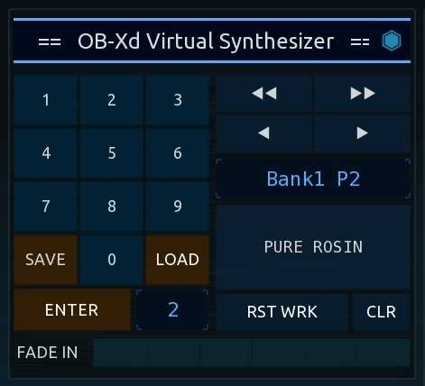

# TouchOSC template for the OB-Xd Virtual Analog Synthesizer

[TouchOSC](https://hexler.net/touchosc/) template for the
[Oberheim OB-Xd Virtual Analog Synthesizer](https://www.discodsp.com/obxd/) (and
possibly other Oberheim OB-X/OB-Xa software emulations).

Layout and functionality of this template were created using OB-Xd versions
3.5.3 through 3.6. Check out the detailed feature list below!

If you like this software, and use it frequently or in a commercial context,
please consider supporting development with a small donation! Check out the
[Donations](#donations) section at the end of this Readme. Thank you!
🙂

## Contents

- [TouchOSC template for the OB-Xd Virtual Analog Synthesizer](#touchosc-template-for-the-ob-xd-virtual-analog-synthesizer)
  - [Contents](#contents)
  - [Screenshots](#screenshots)
  - [Supported features](#supported-features)
    - [OB-Xd support](#ob-xd-support)
    - [Controls and faders](#controls-and-faders)
    - [Surface zoom feature](#surface-zoom-feature)
    - [Shiva Preset manager](#shiva-preset-manager)
  - [Integrated keyboard](#integrated-keyboard)
    - [Positional velocity and modulation support](#positional-velocity-and-modulation-support)
    - [MIDI channelpressure and polyphonic aftertouch](#midi-channelpressure-and-polyphonic-aftertouch)
    - [Keys Sustain – MIDI cc66 "Sustenuto"](#keys-sustain--midi-cc66-sustenuto)
    - [Mapping up to five additional MIDI cc controls to keys aftertouch](#mapping-up-to-five-additional-midi-cc-controls-to-keys-aftertouch)
  - [Usage](#usage)
  - [Download](#download)
  - [Bug reports, Feature Suggestions or Contributing](#bug-reports-feature-suggestions-or-contributing)
  - [Planned features](#planned-features)
  - [Links](#links)
  - [Donations](#donations)

## Screenshots

## Supported features

### OB-Xd support

- All controls of the OB-Xd virtual synth have been implemented. The control
  layout closely follows the OB-Xd "IIkka Rosma Dark" default skin.

- MIDI mappings match the default mappings found in OB-Xd v3.6. So all
  controls should work out of the box, with no further setup neccessary.

  The template also contains a MIDI mappings XML file for OB-Xd. If some MIDI
  mappings do not work as expected (OB-Xd versions below 3.6), try to copy:
  
  [./extra_files/obxd_midi_mapping/TouchOsc.xml](./extra_files/obxd_midi_mapping/TouchOsc.xml)
  
  from this template into your documents "discoDSP" folder:
  
   ... /discoDSP/OB-Xd 3/MIDI/TouchOsc.xml
  
  *The "discoDSP" folder is located in the "Documents" folder in your user's
  `$HOME` directory. The exact naming and location of the "Documents" folder
  differ between operating systems and distributions. Consult the discoDSP
  documentation if you are unsure about the folder location.*

  Restart OB-Xd. The MIDI menu should now show **"TouchOsc"** as a new MIDI mappings
  option.

- Limitations on manipulating the two oscillators in OB-Xd:

  MIDI has the well-known limitation of only supporting 128 discrete steps on CC
  messages, this resolution is, of course, not enough for true continuous
  manipulation of the available oscillator ranges.
  
  While OB-Xd does offer a fine-control setting in the GUI, at the current
  version 3.6, this control is also limited to discrete steps. As such, the
  controls in this surface are *almost on-par* with the resolution available in
  the OB-Xd GUI. Maybe in a future version, OB-Xd will improve the oscillator
  controls, and also add high resolution MIDI support. (MIDI has the option to
  send high resolution values encoded in MSB and LSB bit values, as for example,
  is the default mode for MIDI pitchbend message.)

### Controls and faders

- All faders use a small lua script to ensure high-precision, smooth input
  curves. This script minimizes sudden value "jumps" when starting to
  manipulate a control, and allows for reliable fine-tuning of each fader's
  current position.

- Double-tapping on a fader will reset it to its default zero or center
  position.

- MIDI and true value display:

  Upon touch, all faders show a value tooltip with
  the current MIDI value, or for some faders, a true control value to aid in
  fine-tuning.
  
  **Note:** True value displays are only approximations of the actual value in
  OB-Xd. If the value is a little bit off ..just go by ear ;)

### Surface zoom feature

Double-tap on a section heading or on background/borders to zoom into that
section. Swipe to move around the surface. Double-tap again to zoom out.

The zoom feature is based on the awesome zoom scripts found in this
[GitHub repository](https://github.com/tshoppa/touchOSC/tree/main) by tshoppa!)

### Shiva Preset manager

The template comes with its own preset manager. These presets are not linked to
the OB-Xd presets, but, if you enable MIDI OUT feedback in OB-Xd (v3.5 and
higher), you can copy over and save your favorite presets into the surface.

The preset manager offers a direct access mode for live switching between
existing presets, copy and paste presets between slots, as well as a basic
preset crossfader.

For a full feature list and usage description, check out the
[Shiva Preset Manager README at GitHub](https://github.com/bobbadshy/touchosc_shiva_preset_manager)!
(I designed the preset manager to be modular. So, you can also re-use it
separately for your own TouchOSC surfaces.)

**Preset manager screenshots**

| | Preset manager | |
| --- | --- | -- |
| Extended mode | Direct Access mode | Crossfader active |
|  |  |  |
|  Preset name entry  |  Settings panel  | "Restore Work" button and **\*changed\*** controls indication |
|  |  |  |

## Integrated keyboard

The integrated keyboard currently includes:

- Pitchbend slider, with toggle switch for half or full MIDI range. Full MIDI
  range by default maps to two semitones, so the toggle will switch between one
  semitone and a full tone.

- Octave and transpose buttons.

### Positional velocity and modulation support

The keys support registering vertical, as well as horizontal touch movement.

Velocity is controlled by the initial touch position on the keys: bottom of keys
is loudest, top is the most quiet.

Modulation (MIDI cc1) is engaged by sliding up or down on the keys. The
modulation will stay active after releasing the keys. It will reset only after
all keys have been released, and then when a new key is pressed. This behaviour
seemed the most intuitive, so modulation stays active on the sound after
releasing the keys. When playing is continued, modulation will reset to zero.

**Note:** If you wish to have finer, and full manual control of modulation, the
pitchbend slider can be switched to control modulation instead of pitch.

### MIDI channelpressure and polyphonic aftertouch

The keyboard also supports both global MIDI channel pressure, and individual
keys polyphonic aftertouch. These options can be enabled in the keyboard
settings, to control hardware or software instruments with support for these
features.

- ***Note:** OB-Xd does not support MIDI aftertouch. Read below for alternative
  options to use aftertouch support with OB-Xd!*

### Keys Sustain – MIDI cc66 "Sustenuto"

The keyboard features a "Keys Sustain" control which engages MIDI cc66
"Sustenuto".

When Sustenuto is activated, all currently pressed keys *are held* on releasing
the keys. So, for example, you can hold a chord, and then play some melody over
it. The "Keys Sustain" button supports stacking: Tap once to sustain all
currently pressed keys. Tap again to add new keys. Double-tap or hold and
release to cancel the sustenuto (hold and release for exactly timed cancel upon
button release). You can also switch octaves on the keyboard while sustain is
being held! Play a bass note and sustain it, switch octave, and play a melody on
top. :)

- ***Note:** The keyboard will also respond to MIDI cc66 messages when received
  over MIDI!*

### Mapping up to five additional MIDI cc controls to keys aftertouch

As an advanced feature, the keyboard supports mapping arbitrary MIDI cc messages
onto the vertical or horizontal axis. The horizontal axis offers one slot, the
vertical axis offers to slots that disengage on key release, and two slots that
disengage on the next key press after releasing all keys (same as the modulation
feature).

With this advanced feature, you can add aftertouch functionality to any hardware
or software instruments, and control any aspect of the sound synthesis through
touch movement. Control aftertouch loudness by binding to the Master volume, the
amplitude envelope's sustain control, or to the indiviual mixing control of one
of the oscillators. Manipulate the sound shape by binding to the cutoff
frequency, resonance mix, or to other available synthesizer controls..

**Keyboard screenshots**

- Main controls:

- Keyboard settings panel:

|  |

## Usage

- Download the latest release, and open `obxd.tosc` in TouchOSC.
- Start up OB-Xd and the rest of your music setup and enjoy!

## Download

Check the [Releases](https://github.com/bobbadshy/touchosc_obxd_template/releases) section.

## Bug reports, Feature Suggestions or Contributing

*This is currently a brand new project. First RC release was Jan 2025. So, while
it seems to work well already, please keep in mind that it is **currently in
testing and not ready for production**. Thank you!*

Please file an issue in the [Issues](https://github.com/bobbadshy/touchosc_obxd_template/issues) section.

As this is just a hobby project in my freetime, I cannot promise I will get to
any of them, but nevertheless, suggestions and bug reports are welcome! 🙂

If you have any ideas or want to contribute to the project yourself, feel free
to fork it and submit the changes back to me.

## Planned features

- Light color scheme
- Randomize button, with a toggle to individually include/exclude each controls
  section from randomize. The preset manager actually already has a randomize
  button in its settings panel. However, "Randomize" is a very nice thing to
  have to get started on a sound, and I want to add a button directly next to
  the fader controls.
- More keyboard features:
  - Extra panel with xy pad and faders for all midi supported modulations
    (pitch, vibrato, tremolo, etc.)
  - Separate keyboard zoom ..less octaves, but bigger keys :)
- ...

## Links

- [OB-Xd Virtual Analog Synthesizer from discoDSP](https://www.discodsp.com/obxd/)
- [Hexler TouchOSC](https://hexler.net/touchosc)
- [TouchOSC Scripting API](https://hexler.net/touchosc/manual/script)
- Zoom script and many other useful TouchOSC [modules and plugins by tshoppa](https://github.com/tshoppa/touchOSC/tree/main)

## Donations

This is an Open Source software and free to use for everyone under the GPL-3.0 license! 🙂

|    |  PayPal  |
| -- | -------- |
|  If you feel this software made your life a little easier, and that it is exacly the thing you were looking for, then you can buy me a beer 🍺 (..or beers 🍻..) and I will merrily put out a toast to you for saving yet another evening! 😃  *(I currently only have a PayPal button, but I may check out getting a Patreon or some "Buy me a coffee" in the future.)* |    |

Many Thanks and Enjoy!
